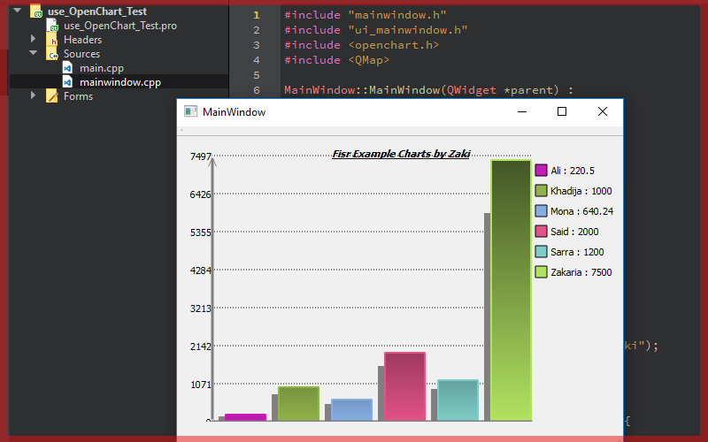

# Qt5 Projects

OpenChart Library

Add this on your (.pro) file:

```QMAKE
INCLUDEPATH += $$PWD/OpenChart/include
LIBS += -L"$$PWD/OpenChart/lib"
LIBS += -lopenchartplugin
```

-----------------


-----------------

 <a href="https://twitter.com/Zaki_Chahboun">@Zaki_Chahboun</a>
<br>
<a href="www.facebook.com/zakaria.chahboun.2018">Zakaria Chahboun</a>


